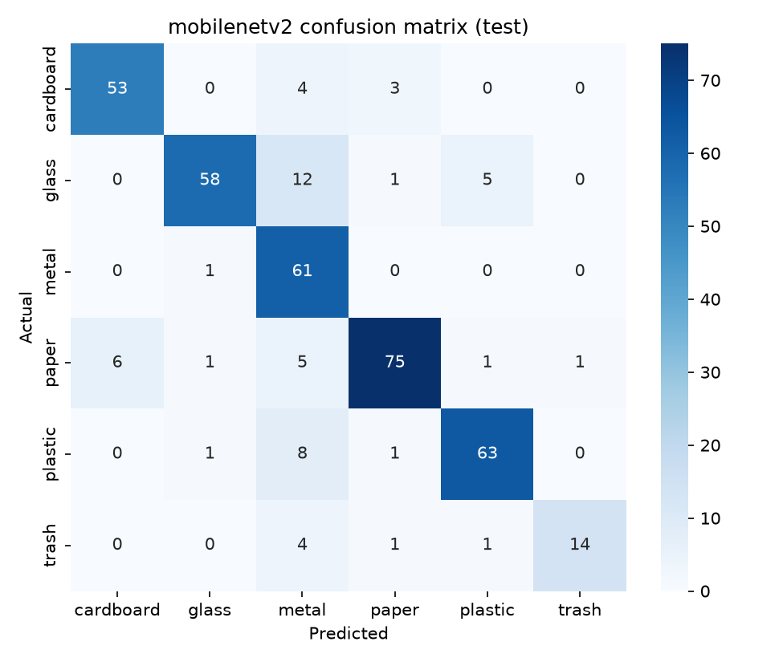
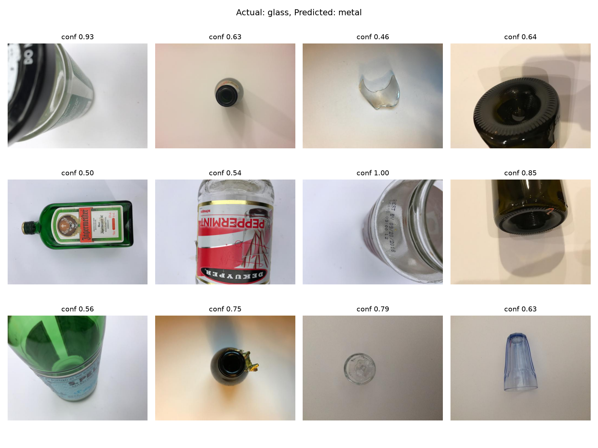

# Smart Waste Classifier with Analytics 
 
Image classification of waste into 6 classes using transfer learning (MobileNetV2). 
 
## Status 
-  Phase 1: Setup and data 
-  Phase 2: Model training and comparison 
-  Phase 3: Error analysis 
-  Phase 4: SQL analytics
 
## Dataset (TrashNet) 
- 2,527 images, 6 classes: cardboard, glass, metal, paper, plastic, trash 
- Imbalanced: trash has 137 images vs paper with 594 (about 4.3x) 
- All images are 512x384 on mostly plain backgrounds 
- Stratified split 70/15/15 (1768 train / 379 val / 380 test) 
- Imbalance handled with class weights; augmentation (flip, rotation, zoom, contrast, brightness) applied to training data only 
 
## Models 
| Model | Description | 
|---|---| 
| Baseline CNN | Small CNN trained from scratch (reference) | 
| MobileNetV2 | ImageNet-pretrained, two-stage transfer learning: train the new head with the base frozen, then fine-tune the top 60 layers at a low learning rate | 
 
## Results 
| Model | Split | Accuracy | Macro F1 | 
|---|---|---|---| 
| Baseline CNN | Validation | 53.8% | 0.51 | 
| MobileNetV2 | Validation | 87.9% | 0.86 | 
| **MobileNetV2** | **Test** | **85.3%** | **0.85** | 
 
Transfer learning improved validation accuracy from about 54% to 88% over the baseline. The model was chosen on the validation set, and the test set was evaluated once. 
 
 
 
## Error analysis 
Most errors are glass misclassified as metal (12 of 76 test images). Reviewing them shows the labels are correct; the model struggles with close-ups of bottle bases and caps, and with transparent or reflective objects. Some errors have very high confidence (up to 1.00), so confidence alone is not a reliable signal of correctness. 
 
 
 
## Limitations 
- Near-duplicate photos of the same object may appear in both train and test (possible data leakage), so the test score may be slightly optimistic. 
- TrashNet has plain backgrounds, so performance on cluttered real-world photos is likely lower. 
- The trash class has only 20 test images, so its scores are unstable. 

## SQL analytics
Predictions are stored in a SQLite database (3 tables: waste_classes, images, predictions; standard SQL, portable to MySQL/PostgreSQL). Queries in `database/queries.sql` cover per-class accuracy, most common confusions, and accuracy by confidence band.

Key finding: predictions with confidence >= 0.8 are 90.7% correct (321 images), while those below 0.8 are only about 56% correct (59 images). A "low confidence, please check manually" rule is a practical safeguard.